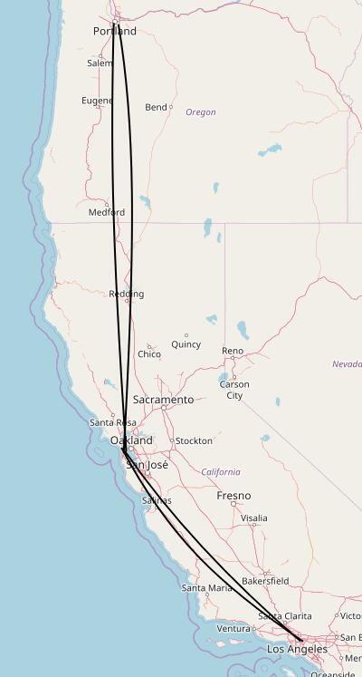
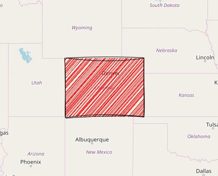

# Leaflet.RoughCanvas

Leaflet.RoughCanvas is a leaflet render. It bases on [Roughjs](https://github.com/pshihn/rough). The library can let you draw vector((multi)polyline, (multi)polygon, geojson) in a hand-drawn-like style.

## Install

The latest leaflet-roughcanvas can be downloaded from the dist [folder]().

or from npm:

```
npm install --save leaflet-roughcanvas
```

## Usage

Include the script after leaflet.js.

```html
    <script src="./leaflet.js"></script>    
    <script src="../dist/leaflet-roughcanvas.js"></script>    
```

### polyline

```js
        // create a polyline from an array of LatLng points
        var latlngs = [
            [45.51, -122.68],
            [37.77, -122.43],
            [34.04, -118.2]
        ];
        var polyline = L.polyline(latlngs, {
            renderer: L.Canvas.roughCanvas(),
            roughness: 2,
            bowing: 2,
            strokeColor: 'black',
            strokeWidth: 2,  
        }).addTo(mymap);
        // zoom the map to the polyline
        mymap.fitBounds(polyline.getBounds());
```




### polygon

```js
        // create a red polygon from an array of LatLng points
        var latlngs = [[37, -109.05], [41, -109.03], [41, -102.05], [37, -102.04]];
        var polygon = L.polygon(latlngs, {
            renderer: L.Canvas.roughCanvas(),
            fillColor: 'red',
            fillStyle: 'hachure',
            fillWeight: 1,
            hachureAngle: -41,
            hachureGap: 3
        }).addTo(mymap);
        // zoom the map to the polygon
        mymap.fitBounds(polygon.getBounds());
```



### geojson

```js
        const randomColor = () => {
            let r = `rgb(${Math.round(Math.random() * 255)}, ${Math.round(Math.random() * 255)}, ${Math.round(Math.random() * 255)})`;
            return r;
        }
        const randomAngle = () => {
            return (Math.random() > 0.5 ? -1 : 1) * (1 + Math.random() * 88);
        }
        const randomStyle = () => {
            return (Math.random() > 0.8 ? 'solid' : '');
        }

        L.geoJSON(china, {
            renderer: L.Canvas.roughCanvas(),
            style: function (feature) {
                styleObj = {
                    hachureAngle: randomAngle(),
                    fillColor: randomColor(),
                    fillStyle: randomStyle(),
                    roughness: 1,
                    bowing: 0.3
                }
                return styleObj
            },
        }).addTo(mymap);
```


## Demo

[Views Demo here](https://zhuang-hao-ming.github.io/Leaflet.RoughCanvas/)

## Config

You can pass in options in every method that accpets style options.

The options are the same as those in [roughjs](https://github.com/pshihn/rough/wiki)

## License

MIT